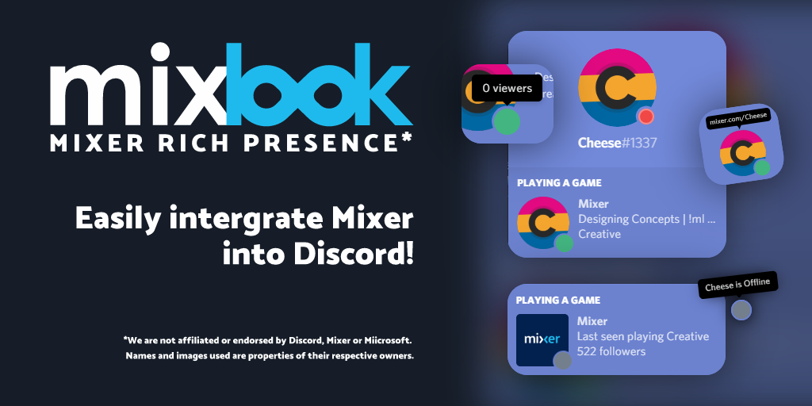

Mixer Rich Presence is a rich presence client that queries the Mixer API and feeds it all to Discord! 

...

*Well someone had to do it*

## Pre-requisites
- [Node.js](https://nodejs.org)
- [Git](https://gitforwindows.org/)
- Mixer username
## Optional
- Custom Avatar

## Features
- Interfaces with the Mixer API
- Detects when you go online and offline and changes accordingly.

## Coming Soon
- An app to run Mixer Rich Presence in the background. Start/Stop toggles, etc.- 
- Add Razer Chroma Support

## Setup
To use this, you need to follow these steps:
- Create an application on the [Discord Developer Portal](https://discordapp.com/developers/applications/) and call it **Mixer**
- Next find the assets folder and drag the contents to **Rich Presence > Art Assets**
- Copy your client ID to your clipboard.
- Go to `config.json` and where username is, enter your username.
- For custom avatars, upload your own avatar to the Art Assets folder. (See [Avatar Section](#Avatar) for details on how to find your avatar URL.
- Click on `install.bat` to install dependencies.

Congratulations, you should now just be able to click on `run.bat` and it'll run it in a console window with full logs.

## Avatar

Find your avatar URL at [Mixlook](https://mixlook.ml) and download it to the assets folder amd name it `profile.png`

Profile size has to be a minimum of 512x512. Otherwise it won't upload the art assets.

Upload that under Art Assets in the Discord Developer Portal.

## Assets Folder
Use these if you want to change your avatar from the default avatar.

## Attributions

Created by the folks at [Orangopus](https://github.com/orangopus). 

*We are not affiliated or endorsed by Discord, Mixer or Microsoft.*

*Names and images used are properties of their respective owners.*
